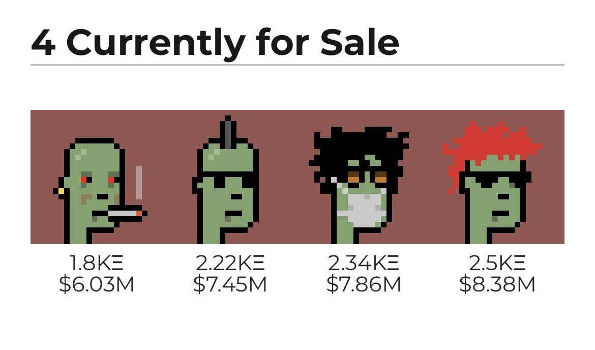
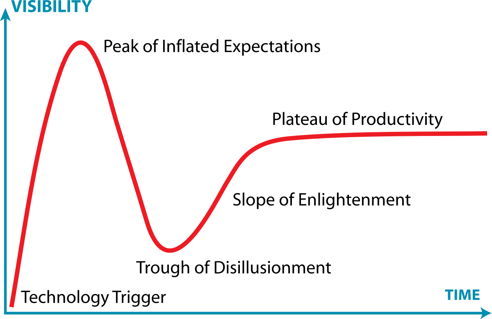

Many readers will already be familiar with the NFT boom and rise of the meme investor. GameStop, AMC, DogeCoin, Crypto Punks, Pudgy Penguins. The list goes on. Matt Levine of Money Stuff [put it best](https://www.bloomberg.com/opinion/articles/2021-08-10/spend-your-bitcoins-at-the-gamestop-in-the-amc):

> Yes, right! Put the GameStop in the AMC! Drive there in a Tesla that you rented at a Hertz! Pay for your tickets with Dogecoin! Cram the whole thing into a rocket ship and send it to Mars! I already said “SPAC”! This is how finance works now; the goal is to say as many meme-trade buzzwords as possible because that is what makes stocks go up. That’s why you do a call like this.

Here are the current going rates for the only four of 10,000 Crypto Punks that are currently on sale:

  
   
  <em> JPEGs! PNGs! GIFs! </em>  

An acquaintance has made over $200K trading NFTs. He aped into GameStop right at the top, lost a lot of money, and learnt his lesson by proceeding to buy into every other meme stock and crypto project he could... His luck was better this time and he is now spending thousands of dollars on sixteen course dinners.  

Tyler Cowen has said that if Bitcoin hits $200,000 then half of the world's billionaires [will be from crypto](https://usethebitcoin.com/if-bitcoin-reaches-200000-more-than-half-the-worlds-billionaires-will-be-from-crypto/). And with Bitcoin back at $50,000, it is safe to guess a substantial number of millionaires originate from various blockchains. Given that the world's richest set the tone for what in society is desirable and have the ability to influence other movers and shakers such as politicians, what effects will this have on society? And because this is speculation driven wealth, at least until any real applications come out of crypto, it is zero sum. You could abstractly say that wealth has gone from being predominantly aristocratic to meritocratic to ... techno/meme based? While the aristocratic system was the birth lottery instead of the crypto lottery, at least there were strong expectations for the aristocracy to be philanthropic or use their time for high minded scientific pursuits. Just think of Galton, Darwin, Newton, etc and the wealth they were born into that enabled them to make their scientific and society advancing discoveries.

It would be one thing if most of the new crypto zillionaires were coders and cryptographers who were clever and creative enough to build these systems. Then the new world's wealthiest would still fit into the meritocratic category just with a much larger tech and libertarian twist. And while there certainly are some of these people, I would like to see a survey but am scared to know the results for how many of those in crypto actually understand anything about Bzyantine Fault Tolerance (BFT), Proof of Work, or how any modern blockchains function. I was struck when Balaji Srinivasan, one of the patron saints of crypto, talked in [this panel](https://www.youtube.com/watch?v=v0mwbNhmlEA) talked about Nakamoto Consensus and Bitcoin as if he was completely unaware of the deep history of BFT consensus protocols that had come before.

The amount of hype around crypto that currently exists, especially around NFTs, but also the market more broadly, makes it feel like the dot com boom all over again. This doesn't mean there won't be amazing applications of crypto in the future... if it can get over all the [regulatory hurdles](https://www.bloomberg.com/opinion/articles/2021-08-09/the-sec-has-some-crypto-complaints). But I think we are about to see the Gartner Hype Cycle in full force:

  
   
  <em> Up! Down! Slowly back up over the course of multiple years. </em>  

---

March 2022 Update/Clarification:

I think that crypto is having some amazing innovation in Decentralized Finance (DeFi) and prediction markets but this is about it for now. Not to say that others won't emerge later but they have yet to. And upon attending ETH Denver this year, yes... there is an incredible amount of crypto wealth and the future is going to be weirder because of it... 
